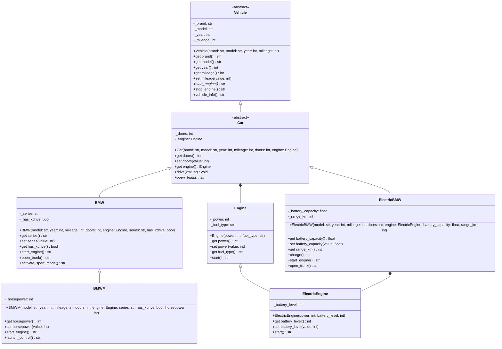

```mermaid

classDiagram
direction TB

class Vehicle {
    <<abstract>>
    -_brand: str
    -_model: str
    -_year: int
    -_mileage: int
    +Vehicle(brand: str, model: str, year: int, mileage: int)
    +get brand() str
    +get model() str
    +get year() int
    +get mileage() int
    +set mileage(value: int)
    +start_engine()* str
    +stop_engine() str
    +vehicle_info() str
}

class Car {
    <<abstract>>
    -_doors: int
    -_engine: Engine
    +Car(brand: str, model: str, year: int, mileage: int, doors: int, engine: Engine)
    +get doors() int
    +set doors(value: int)
    +get engine() Engine
    +drive(km: int) void
    +open_trunk() str*
}

class BMW {
    -_series: str
    -_has_xdrive: bool
    +BMW(model: str, year: int, mileage: int, doors: int, engine: Engine, series: str, has_xdrive: bool)
    +get series() str
    +set series(value: str)
    +get has_xdrive() bool
    +start_engine() str
    +open_trunk() str
    +activate_sport_mode() str
}

class BMWM {
    -_horsepower: int
    +BMWM(model: str, year: int, mileage: int, doors: int, engine: Engine, series: str, has_xdrive: bool, horsepower: int)
    +get horsepower() int
    +set horsepower(value: int)
    +start_engine() str
    +launch_control() str
}

class ElectricBMW {
    -_battery_capacity: float
    -_range_km: int
    +ElectricBMW(model: str, year: int, mileage: int, doors: int, engine: ElectricEngine, battery_capacity: float, range_km: int)
    +get battery_capacity() float
    +set battery_capacity(value: float)
    +get range_km() int
    +charge() str
    +start_engine() str
    +open_trunk() str
}

class Engine {
    -_power: int
    -_fuel_type: str
    +Engine(power: int, fuel_type: str)
    +get power() int
    +set power(value: int)
    +get fuel_type() str
    +start() str
}

class ElectricEngine {
    -_battery_level: int
    +ElectricEngine(power: int, battery_level: int)
    +get battery_level() int
    +set battery_level(value: int)
    +start() str
}

Vehicle <|-- Car
Car <|-- BMW
BMW <|-- BMWM
Car <|-- ElectricBMW
Engine <|-- ElectricEngine

Car *-- Engine
ElectricBMW *-- ElectricEngine

```