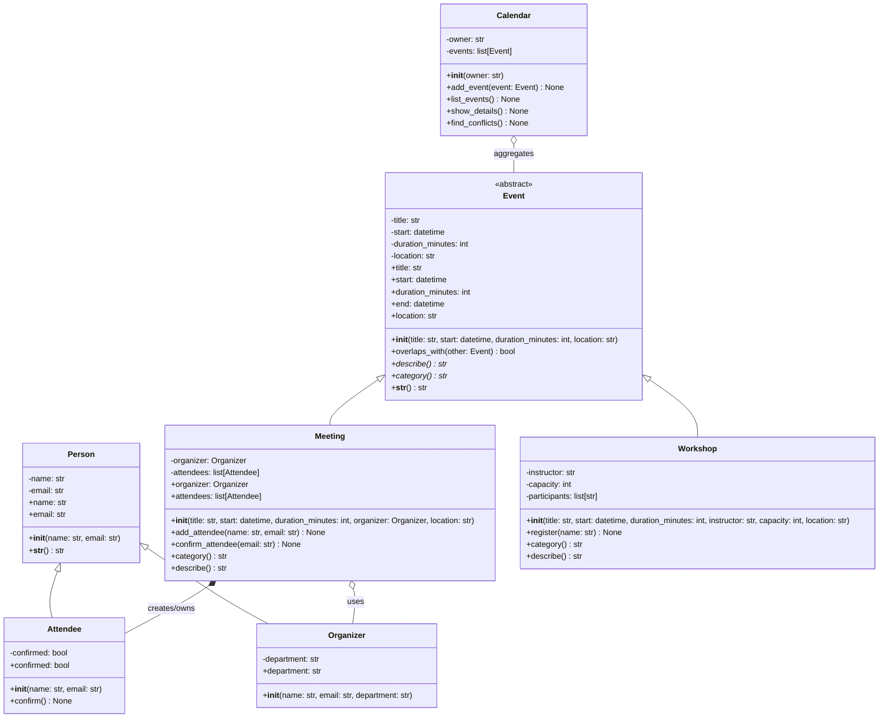

```mermaid

classDiagram
    class Person {
        -name: str
        -email: str
        +__init__(name: str, email: str)
        +name: str
        +email: str
        +__str__() str
    }

    class Organizer {
        -department: str
        +__init__(name: str, email: str, department: str)
        +department: str
    }

    class Attendee {
        -confirmed: bool
        +__init__(name: str, email: str)
        +confirmed: bool
        +confirm() None
    }

    class Event {
        <<abstract>>
        -title: str
        -start: datetime
        -duration_minutes: int
        -location: str
        +__init__(title: str, start: datetime, duration_minutes: int, location: str)
        +title: str
        +start: datetime
        +duration_minutes: int
        +end: datetime
        +location: str
        +overlaps_with(other: Event) bool
        +describe()* str
        +category()* str
        +__str__() str
    }

    class Meeting {
        -organizer: Organizer
        -attendees: list[Attendee]
        +__init__(title: str, start: datetime, duration_minutes: int, organizer: Organizer, location: str)
        +organizer: Organizer
        +attendees: list[Attendee]
        +add_attendee(name: str, email: str) None
        +confirm_attendee(email: str) None
        +category() str
        +describe() str
    }

    class Workshop {
        -instructor: str
        -capacity: int
        -participants: list[str]
        +__init__(title: str, start: datetime, duration_minutes: int, instructor: str, capacity: int, location: str)
        +register(name: str) None
        +category() str
        +describe() str
    }

    class Calendar {
        -owner: str
        -events: list[Event]
        +__init__(owner: str)
        +add_event(event: Event) None
        +list_events() None
        +show_details() None
        +find_conflicts() None
    }

    Person <|-- Organizer
    Person <|-- Attendee

    Event <|-- Meeting
    Event <|-- Workshop

    Meeting *-- Attendee : creates/owns
    Meeting o-- Organizer : uses
    Calendar o-- Event : aggregates

```