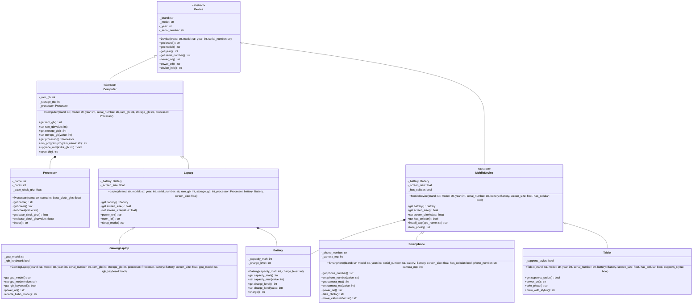

```mermaid


classDiagram
direction TB

class Device {
    <<abstract>>
    -_brand: str
    -_model: str
    -_year: int
    -_serial_number: str
    +Device(brand: str, model: str, year: int, serial_number: str)
    +get brand() str
    +get model() str
    +get year() int
    +get serial_number() str
    +power_on()* str
    +power_off() str
    +device_info() str
}

class Processor {
    -_name: str
    -_cores: int
    -_base_clock_ghz: float
    +Processor(name: str, cores: int, base_clock_ghz: float)
    +get name() str
    +get cores() int
    +set cores(value: int)
    +get base_clock_ghz() float
    +set base_clock_ghz(value: float)
    +boost() str
}

class Battery {
    -_capacity_mah: int
    -_charge_level: int
    +Battery(capacity_mah: int, charge_level: int)
    +get capacity_mah() int
    +set capacity_mah(value: int)
    +get charge_level() int
    +set charge_level(value: int)
    +charge() str
}

class Computer {
    <<abstract>>
    -_ram_gb: int
    -_storage_gb: int
    -_processor: Processor
    +Computer(brand: str, model: str, year: int, serial_number: str, ram_gb: int, storage_gb: int, processor: Processor)
    +get ram_gb() int
    +set ram_gb(value: int)
    +get storage_gb() int
    +set storage_gb(value: int)
    +get processor() Processor
    +run_program(program_name: str) str
    +upgrade_ram(extra_gb: int) void
    +open_lid()* str
}

class Laptop {
    -_battery: Battery
    -_screen_size: float
    +Laptop(brand: str, model: str, year: int, serial_number: str, ram_gb: int, storage_gb: int, processor: Processor, battery: Battery, screen_size: float)
    +get battery() Battery
    +get screen_size() float
    +set screen_size(value: float)
    +power_on() str
    +open_lid() str
    +sleep_mode() str
}

class GamingLaptop {
    -_gpu_model: str
    -_rgb_keyboard: bool
    +GamingLaptop(brand: str, model: str, year: int, serial_number: str, ram_gb: int, storage_gb: int, processor: Processor, battery: Battery, screen_size: float, gpu_model: str, rgb_keyboard: bool)
    +get gpu_model() str
    +set gpu_model(value: str)
    +get rgb_keyboard() bool
    +power_on() str
    +enable_turbo_mode() str
}

class MobileDevice {
    <<abstract>>
    -_battery: Battery
    -_screen_size: float
    -_has_cellular: bool
    +MobileDevice(brand: str, model: str, year: int, serial_number: str, battery: Battery, screen_size: float, has_cellular: bool)
    +get battery() Battery
    +get screen_size() float
    +set screen_size(value: float)
    +get has_cellular() bool
    +install_app(app_name: str) str
    +take_photo()* str
}

class Smartphone {
    -_phone_number: str
    -_camera_mp: int
    +Smartphone(brand: str, model: str, year: int, serial_number: str, battery: Battery, screen_size: float, has_cellular: bool, phone_number: str, camera_mp: int)
    +get phone_number() str
    +set phone_number(value: str)
    +get camera_mp() int
    +set camera_mp(value: int)
    +power_on() str
    +take_photo() str
    +make_call(number: str) str
}

class Tablet {
    -_supports_stylus: bool
    +Tablet(brand: str, model: str, year: int, serial_number: str, battery: Battery, screen_size: float, has_cellular: bool, supports_stylus: bool)
    +get supports_stylus() bool
    +power_on() str
    +take_photo() str
    +draw_with_stylus() str
}

Device <|-- Computer
Computer <|-- Laptop
Laptop <|-- GamingLaptop

Device <|-- MobileDevice
MobileDevice <|-- Smartphone
MobileDevice <|-- Tablet

Computer *-- Processor
Laptop *-- Battery
MobileDevice *-- Battery

```