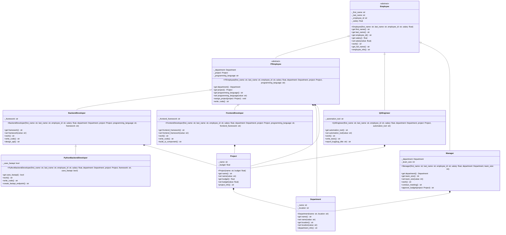

```mermaid

classDiagram
direction TB

class Employee {
    <<abstract>>
    -_first_name: str
    -_last_name: str
    -_employee_id: str
    -_salary: float
    +Employee(first_name: str, last_name: str, employee_id: str, salary: float)
    +get first_name() str
    +get last_name() str
    +get employee_id() str
    +get salary() float
    +set salary(value: float)
    +work()* str
    +get_full_name() str
    +employee_info() str
}

class Department {
    -_name: str
    -_location: str
    +Department(name: str, location: str)
    +get name() str
    +set name(value: str)
    +get location() str
    +set location(value: str)
    +department_info() str
}

class Project {
    -_name: str
    -_budget: float
    +Project(name: str, budget: float)
    +get name() str
    +set name(value: str)
    +get budget() float
    +set budget(value: float)
    +project_info() str
}

class ITEmployee {
    <<abstract>>
    -_department: Department
    -_project: Project
    -_programming_language: str
    +ITEmployee(first_name: str, last_name: str, employee_id: str, salary: float, department: Department, project: Project, programming_language: str)
    +get department() Department
    +get project() Project
    +get programming_language() str
    +set programming_language(value: str)
    +assign_project(project: Project) void
    +write_code()* str
}

class BackendDeveloper {
    -_framework: str
    +BackendDeveloper(first_name: str, last_name: str, employee_id: str, salary: float, department: Department, project: Project, programming_language: str, framework: str)
    +get framework() str
    +set framework(value: str)
    +work() str
    +write_code() str
    +design_api() str
}

class PythonBackendDeveloper {
    -_uses_fastapi: bool
    +PythonBackendDeveloper(first_name: str, last_name: str, employee_id: str, salary: float, department: Department, project: Project, framework: str, uses_fastapi: bool)
    +get uses_fastapi() bool
    +work() str
    +write_code() str
    +create_fastapi_endpoint() str
}

class FrontendDeveloper {
    -_frontend_framework: str
    +FrontendDeveloper(first_name: str, last_name: str, employee_id: str, salary: float, department: Department, project: Project, programming_language: str, frontend_framework: str)
    +get frontend_framework() str
    +set frontend_framework(value: str)
    +work() str
    +write_code() str
    +build_ui_component() str
}

class QAEngineer {
    -_automation_tool: str
    +QAEngineer(first_name: str, last_name: str, employee_id: str, salary: float, department: Department, project: Project, automation_tool: str)
    +get automation_tool() str
    +set automation_tool(value: str)
    +work() str
    +write_tests() str
    +report_bug(bug_title: str) str
}

class Manager {
    -_department: Department
    -_team_size: int
    +Manager(first_name: str, last_name: str, employee_id: str, salary: float, department: Department, team_size: int)
    +get department() Department
    +get team_size() int
    +set team_size(value: int)
    +work() str
    +conduct_meeting() str
    +approve_budget(project: Project) str
}

Employee <|-- ITEmployee
ITEmployee <|-- BackendDeveloper
BackendDeveloper <|-- PythonBackendDeveloper
ITEmployee <|-- FrontendDeveloper
Employee <|-- QAEngineer
Employee <|-- Manager

ITEmployee *-- Department
ITEmployee *-- Project
Manager *-- Department
BackendDeveloper *-- Project
FrontendDeveloper *-- Project
QAEngineer *-- Project
Project *-- Department

```